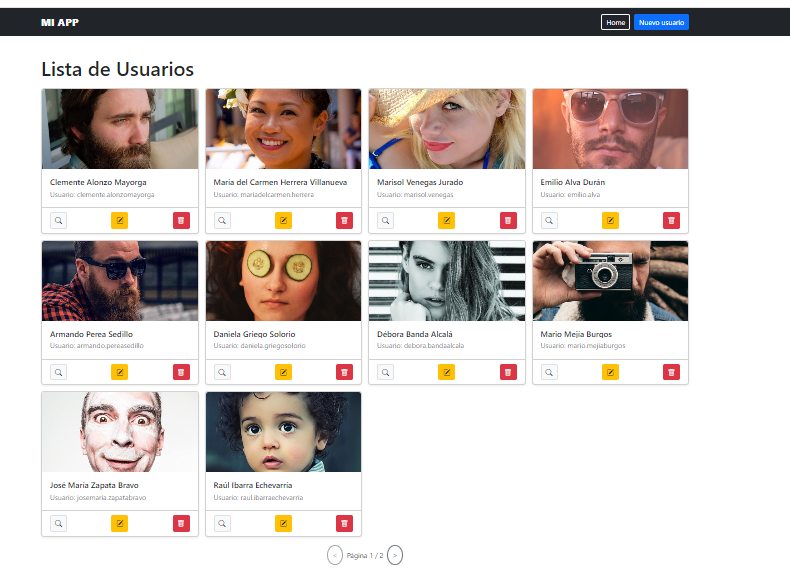
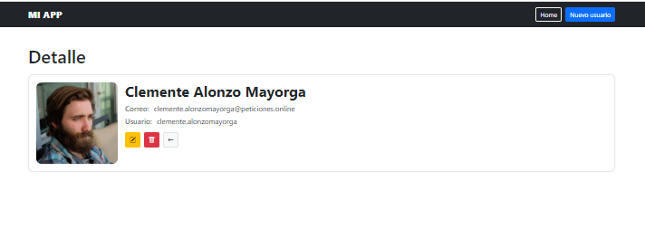
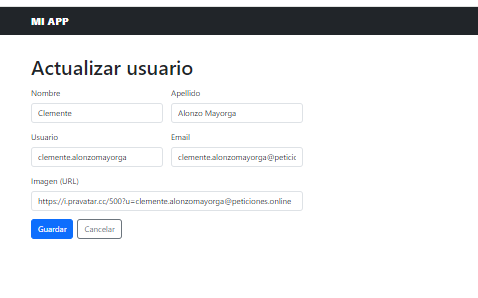
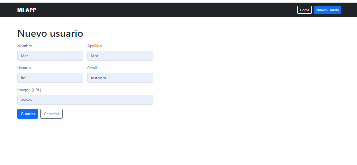
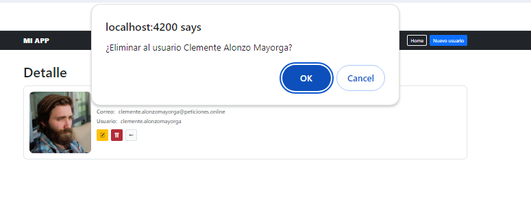

# Mi App (Actividad 6)

**Autor:** Marlene Nielsen  
**Stack:** Git Bash · Angular 20 · TypeScript · Bootstrap 5

## Descripción
Aplicación CRUD de usuarios: listado en grid, acciones de **detalle**, **actualizar**, **borrar**, y **creación/edición** usando el mismo formulario. Incluye paginación y navegación por rutas.

## Rutas principales
- `/home` — Grid de usuarios con acciones Ver / Editar / Eliminar y paginación
- `/user/:id` — Detalle (foto, correo, usuario)
- `/newuser` — Crear usuario (validaciones)
- `/updateuser/:id` — Actualizar usuario (mismo formulario reutilizado)

## Requisitos
- Node.js LTS  
- Angular CLI (`npm i -g @angular/cli`) o usar `npx`

## Ejecutar en desarrollo

```bash
npm i
ng serve -o
```

## Capturas de pantalla

### Home (listado de usuarios con acciones)


### Detalle de usuario


### Formulario de actualización


### Crear nuevo usuario


### Borrar usuario (confirmación)

